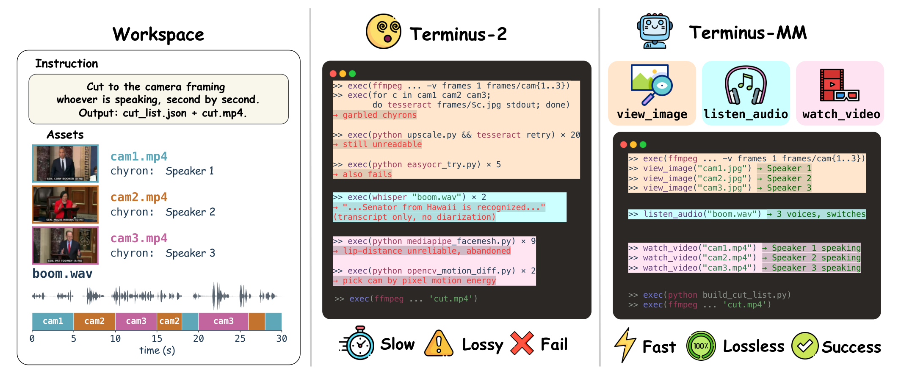

# MultiMedia-TerminalBench (MMTB)

📄 [Paper (arXiv)](https://arxiv.org/abs/2605.10966) &nbsp; &nbsp; 🌐 [Project Page](https://mm-tbench.github.io/multimedia-terminal-bench/) &nbsp; &nbsp; 🤗 [Dataset](https://huggingface.co/datasets/mm-tbench/mmtb-media) &nbsp; &nbsp; 💻 [Code](https://github.com/mm-tbench/multimedia-terminal-bench) &nbsp; &nbsp; 📦 [Harbor Registry](https://registry.harborframework.com/datasets/mmtb/multimedia-terminalbench)

A benchmark for **terminal agents that work directly with audio and video files**.



*An example MMTB task and two terminal-agent approaches.* The task merges
three videos and one audio file into one edited artifact. Agents with native
multimodal access read the raw files directly; text-only agents must reach
the same evidence through command-line tools (OCR, ASR, motion-energy),
adding processing steps that introduce inefficiency and errors.

Existing terminal-agent benchmarks score agents on text, code, and structured
files. But many real workflows hand the practitioner a folder of media —
recordings to trim, a video to align, an audio file to caption — and ask for a
deliverable that depends on what is actually in the media. MMTB is built for
that setting. Each task gives the agent a persistent terminal workspace with
audio and video files, an instruction, and an output specification; the agent
must inspect the media, ground its actions in auditory or visual evidence, and
write a verifiable artifact (a selected file, a timestamp, a JSON/CSV record,
an edit list, or a processed media file) to a fixed path.

The suite contains **105 tasks across 5 meta-categories and 16 fine-grained
workflow categories**, with **536 media files** totalling **6 h 54 min** of
timed audio-visual content (median 1 m 20 s per task). Tasks are anchored to
specific public scenarios drawn from paid practitioner workflows on Upwork,
Fiverr, casting and voiceover platforms, practitioner forums, and industry
standards documents — so the suite reflects the multimedia work people are
actually paid to do, not synthetic instruction templates.

Tasks are packaged in the [Harbor](https://www.harborframework.com/docs)
format used by Terminal-Bench, so any Harbor-compatible agent can run the
suite with the workspace and evaluator held fixed. See the
[Documentation](#documentation) section below for upstream Harbor pointers.

## Headline results from the paper

Strongest configurations under MMTB's 10-minute interaction budget:

| Agent | Backbone | Binary success | Partial success |
|---|---|---:|---:|
| **Terminus-MM** (full multimedia) | Gemini-3.1-Pro | **0.371** | **0.469** |
| Terminus-IV (text + image + video) | Gemini-3.1-Pro | 0.333 | 0.432 |
| Terminus-IA (text + image + audio) | Gemini-3.1-Pro | 0.333 | 0.406 |
| Codex CLI | GPT-5.2 | 0.162 | 0.202 |
| Claude Code | Sonnet-4.6 | 0.162 | 0.186 |
| Terminus-2 (text only) | Gemini-3.1-Pro | 0.124 | 0.162 |
| Terminus-KIRA (text + image) | Gemini-3.1-Pro | 0.105 | 0.159 |

Even the strongest setting solves fewer than half the suite, leaving
substantial headroom. See the paper for the full results, modality-ladder
ablation, proxy-cost analysis, and failure breakdown.

## Quick start

Requires Docker and Python 3.11+.

```bash
# 1. Install Harbor
uv tool install harbor

# 2. Clone and set up
git clone https://github.com/mm-tbench/multimedia-terminal-bench.git
cd multimedia-terminal-bench

# 3. Download media assets (mirrored on HuggingFace Hub)
uv run python scripts/download_media.py

# 4. Configure an API key
cp .env.example .env
# Edit .env to set the provider key for the model you plan to run
# (e.g. GEMINI_API_KEY, ANTHROPIC_API_KEY, OPENAI_API_KEY).

# 5. Run a task with Terminus-MM
source .env
harbor run \
  --agent-import-path mmtb_runtime.agent:TerminusMM \
  -p datasets/mmtb-core/audience-ringtone-detection \
  -m gemini/gemini-3.1-pro-preview
```

Models are addressed in LiteLLM `<provider>/<model>` form (e.g.
`gemini/gemini-3.1-pro-preview`, `anthropic/claude-sonnet-4-6`,
`openrouter/google/gemini-3.1-pro-preview`). Any provider LiteLLM supports
will work; pick whichever fits your access.

## Quick start (Harbor registry)

MMTB is also published on the Harbor registry as
[`mmtb/multimedia-terminalbench@v1.0`](https://registry.harborframework.com/datasets/mmtb/multimedia-terminalbench).
The registry path is the no-clone route for off-the-shelf agents:

```bash
# Single task
harbor run -t mmtb/audience-ringtone-detection@v1.0 \
  -a claude-code -m anthropic/claude-sonnet-4-6

# Full dataset (105 tasks)
harbor run -d mmtb/multimedia-terminalbench@v1.0 \
  -a codex-cli -m openai/gpt-5.2
```

The Terminus family (`terminus-mm`, `terminus-kira`, …) lives in this
repository's `mmtb_runtime/` package, so it still requires the local clone;
combine the registry dataset with the local agent import path:

```bash
harbor run -d mmtb/multimedia-terminalbench@v1.0 \
  --agent-import-path mmtb_runtime.agent:TerminusMM \
  -m gemini/gemini-3.1-pro-preview
```

See [REPRODUCE.md](REPRODUCE.md) for the full benchmark sweep instructions.

## Benchmark protocol

Every task is a self-contained Harbor unit with five parts:

1. **Instruction** — the user goal and required deliverable, stated without
   exposing the answer.
2. **Workspace** — a containerized filesystem with the multimedia files and
   any supporting files.
3. **Terminal/tool interface** — the operations the agent may invoke, fixed
   by the harness.
4. **Output schema** — the path and format of the required artifact.
5. **Artifact evaluator** — a deterministic verifier that scores the produced
   artifact and assigns both a partial score and a binary verdict against a
   task-specific threshold.

Across all agents, the benchmark fixes the workspace, preinstalled terminal
tools, instructions, evaluators, logging protocol, and **10-minute
interaction budget**. Scoring depends only on the final artifact, not on the
agent's rationale or command trace. Standard terminal tools (`ffmpeg`,
`ffprobe`, ASR, OCR, silence detection, signal-processing scripts) are
available throughout — they reflect realistic terminal workflows, and the
trace logs distinguish runs that use native perception from runs that proxy
the media through command-line conversions.

## Agent harnesses

The repository ships the controlled Terminus family used in the paper, plus
adapters for two off-the-shelf terminal agents:

| Agent | Native perception | Use for |
|---|---|---|
| `terminus-2` ([Merrill et al., 2026](https://github.com/harbor-framework/harbor)) | None (text only) | Text-only baseline |
| `terminus-kira` ([KRAFTON-AI, 2024](https://github.com/krafton-ai/KIRA)) | Image | Image-only baseline |
| `terminus-a` | Audio | Single-modality (audio-only) ablation |
| `terminus-ia` | Image + audio | Two-modality ablation |
| `terminus-iv` | Image + video | Two-modality ablation |
| **`terminus-mm`** | **Image + audio + video** | **Full multimedia (paper headline)** |
| `claude-code` | Own tools | Off-the-shelf agent baseline |
| `codex-cli` | Own tools | Off-the-shelf agent baseline |

Terminus-MM is built on Terminus-2 and Terminus-KIRA, adding three native
perception tools — `watch_video`, `listen_audio`, `view_image` — that send
raw media bytes to the model so it can perceive the content directly rather
than reasoning over derived transcripts or sampled frames. Terminus-MM also
applies **workspace-aware modality masking**: at task launch it scans the
workspace, maps file extensions to available modalities, and exposes only
the perception tools matched by the files present. The paper shows that
removing this routing degrades both binary and partial success on every
backbone evaluated.

Wrapper scripts for each harness are in `scripts/` (e.g.
`scripts/run_terminus_mm.sh`, `scripts/run_terminus_kira.sh`,
`scripts/run_codex_cli.sh`). They set `PYTHONPATH` and forward the
`harbor run` invocation.

## Bring your own agent

Any Harbor-compatible agent can run MMTB tasks directly. To register a new
agent, point Harbor at your import path and reuse the same task workspaces
and verifiers:

```bash
harbor run \
  --agent-import-path your_pkg.agent:YourAgent \
  -p datasets/mmtb-core/<task> \
  -m <provider>/<model>
```

The verifier writes the partial score and binary verdict to
`/logs/verifier/` inside the run directory; aggregate as you see fit.

## Tasks

The 105 tasks span five meta-categories — media production, performance and
coaching, enterprise and compliance, personal and education, and operations
and research. One representative task per meta-category:

| Meta-category | Task | What the agent must do |
|---|---|---|
| Media production | `multicam-active-speaker-cut` | Given 3 ISO camera angles plus a boom mix, identify per second which camera frames the active speaker, then emit a cut list and rendered cut video (the paper's Figure 1 showcase task) |
| Performance and coaching | `piano-practice-feedback` | Read a printed sheet-music image, listen to a practice recording, and flag wrong-pitch, missed-note, and timing-error mistakes as a structured feedback JSON |
| Enterprise and compliance | `call-center-disclosure-audit` | Audit a recorded support call against compliance policy by jointly inspecting spoken disclosures and CRM-UI screen actions |
| Personal and education | `lecture-demo-clip-extract` | Locate the on-screen timestamp window for each labeled slide in a 25-min CC-BY-NC conference talk and quote a verbatim phrase the presenter says while each slide is visible |
| Operations and research | `traffic-cam-incident-audit` | For each clip, decide whether dispatch radio calls match the visible traffic-cam events; the agent must hold a unified A+V picture across vehicles, light states, and dispatch claims |

Browse `datasets/mmtb-core/` for the full set. Each task ships with an
`instruction.md`, a `media.toml` recording asset provenance, license, and
content hashes, the `environment/` Dockerfile that builds the workspace, and
a verifier under `tests/`.

## Media assets

Media files live on the HuggingFace Hub (too large for git):

```bash
./scripts/download_media.sh                  # Download all
./scripts/download_media.sh <task-name>      # Download one task
```

The mirror at
[`mm-tbench/mmtb-media`](https://huggingface.co/datasets/mm-tbench/mmtb-media)
is public; no token needed. All MMTB tasks source from license-compatible
content with provenance recorded in each task's `media.toml`.

## Documentation

MMTB-specific docs:

| Document | Description |
|---|---|
| [Getting Started](Docs/getting-started.md) | Setup, running tasks, viewing results |
| [Harbor Reference](Docs/harbor-reference.md) | Local cheat sheet for the Harbor CLI, task format, and agents as used in MMTB |

Upstream Harbor (the framework MMTB tasks run on):

| Resource | Description |
|---|---|
| [harborframework.com/docs](https://www.harborframework.com/docs) | Official Harbor documentation — CLI reference, task format, agent SDK, execution environments |
| [github.com/harbor-framework/harbor](https://github.com/harbor-framework/harbor) | Harbor source code, releases, and issue tracker |
| [github.com/harbor-framework/harbor-cookbook](https://github.com/harbor-framework/harbor-cookbook) | Worked examples and recipes for authoring tasks and agents |

If you want to author your own Harbor agent or task outside MMTB, the upstream
docs and cookbook are the authoritative source.

## License

MIT.

## Citation

```bibtex
@misc{heo2026mmtbevaluatingterminalagents,
      title={MMTB: Evaluating Terminal Agents on Multimedia-File Tasks}, 
      author={Chiyeong Heo and Jaechang Kim and Junhyuk Kwon and Hoyoung Kim and Dongmin Park and Jonghyun Lee and Jungseul Ok},
      year={2026},
      eprint={2605.10966},
      archivePrefix={arXiv},
      primaryClass={cs.MM},
      url={https://arxiv.org/abs/2605.10966}, 
}
```
